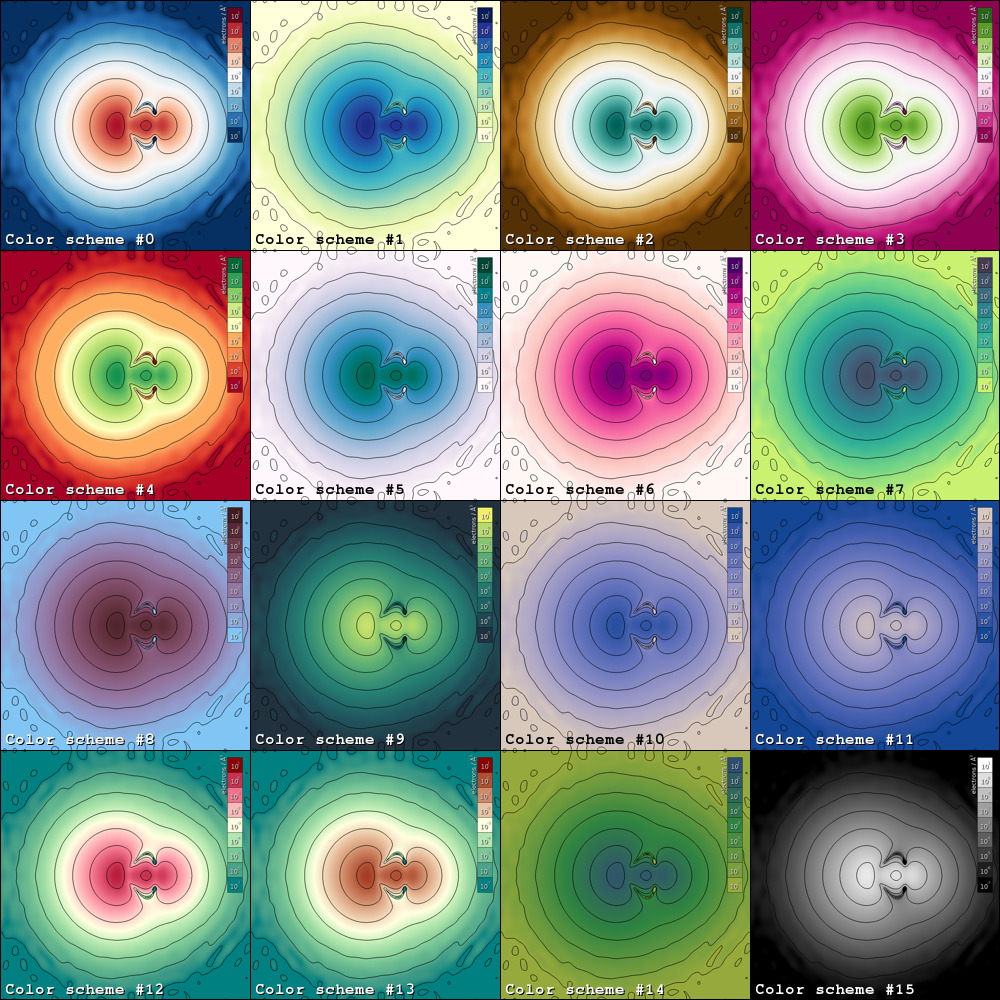

.. _examples:
.. index:: Examples

Examples
********

A series of typical usage scenarios are given, including the result and the
source code.

.. note::
   * Three different model systems are used in the examples below. More information
     on these model systems can be found under :ref:`Model systems<model systems>`.
   * The examples below can be reproduced from the electron density files as
     stored in ``dataset.tar.bz2`` which can be found under ``src/test/testinput``.
   * It is assumed that the executable ``edp`` is available from the ``$PATH``.

Electron density projection
===========================

Consider the benzene molecule, centered in a rectangular unit cell with dimensions
`14.313320 Å x 14.980580 Å x 10.000000 Å`. To generate a projection of the
electron density onto a plane spanned by the normal vectors :math:`\vec{v} = (1,0,0)`
and :math:`\vec{w} = (0,1,0)` going through the center of the unit cell, the following
command in run::

    edp -i PARCHG_BENZENE_07 -o benzene_xy.png \
    -p 7.15666,7.49029,5.0 -v 1,0,0 -w 0,1,0 -s 25

.. figure:: _static/img/benzene_xy_01.png
   :alt: Projection of the electron density of benzene through the xy plane.

If no bounds are set, the electron density is by default projected according to
:math:`\rho \in (10^{-7},10^{2})`.

Setting bounds and adding legend
--------------------------------

To set the bounds of the electron density to :math:`\rho \in (10^{-5},10^{0})`
and add a legend to the plot, the following command is used::

   edp -i PARCHG_BENZENE_07 -o benzene_xy.png \
   -p 7.15666,7.49029,5.0 -v 1,0,0 -w 0,1,0 -s 25 -b -5,0 -l

.. figure:: _static/img/benzene_xy_02.png
   :alt: Projection of the electron density of benzene through the xy plane including legend and setting new bounds.

Instead of specifying the center of unit the unit cell by hand, we can perform the
same operation by using atom indices. Since all the atoms lie on the :math:`xy`-
plane through the center of the unit cell, we can pick any atom. Here, we have
used the first atom::

   edp -i PARCHG_BENZENE_07 -o benzene_xy.png -p 1 -v 1,0,0 -w 0,1,0 -s 25 -b -5,0 -l

Specifying a different plane
----------------------------

To produce the projection onto the :math:`xz`-plane through the first carbon atom,
the following command is used::

    edp -i PARCHG_BENZENE_07 -v 1,0,0 -w 0,0,1 -s 25 -p 1 -o benzene_xz.png -b -5,0 -l

.. figure:: _static/img/benzene_xz_01.png
   :alt: Projection of the electron density of benzene through the xz plane.

Increasing projection plane size
--------------------------------

To increase the scale of the image, we can use 30 pixels/Å instead of
25 pixels/Å as used in the previous examples::

    edp -i PARCHG_BENZENE_07 -v 1,0,0 -w 0,0,1 -s 30 -p 1 -o benzene_xz.png -b -5,0 -l

.. figure:: _static/img/benzene_xz_02.png
   :alt: Projection of the electron density of benzene through the xz plane.

Color schemes
=============

:program:`EDP` supports 16 color schemes as schematically shown in the image
below. To select a color scheme, append the following to the command line
instructions: ``-c <color-scheme-id>`` where ``<color-scheme-id>`` should be a number
between 0-15, inclusive.

.. note::
   The color schemes are extracted from the following resources.

   * `Color brewer 2.0 <http://colorbrewer2.org>`_
   * `Colorpicker for data (tristen.ca) <http://tristen.ca/hcl-picker/#/hlc/6/1.05/CAF270/453B52>`_
   * `Chroma.js Color Scale Helper <http://gka.github.io/palettes>`_
   * `Paletton <http://paletton.com/>`_

Special features
================

Z-averaging
-----------

Consider the :math:`(111)\;2x2` termination of FCC Al using 7 layers. Besides
projecting the electron density onto the plane, we can supply an additional instruction
to calculate the total electron density per plane lying in the :math:`z`-direction::

    edp -i CHGCAR_Al_FCC111 -o al_fcc111_xz.png \
    -p 28 -v 1,0,0 -w 0,0,1 -s 25 -b -5,0 -l -z

The result is stored in `z_extraction.txt` which can be readily visualized using
a simple Python script.

Line extraction
---------------

Consider the methane molecule at the center of a cubic unit cell of length 10 Å.
We wish to calculate the average electron density alongside a line running through
the central carbon atom to one of the H atoms::

    edp -i CHGCAR_CH4 -o ch4.png \
    -p 1 -v 1,0,0 -w 0,1,0 -s 25 -e 1-2

The result is stored in `line_extraction.txt`.

.. figure:: _static/img/ch4_line.jpg
   :alt: Electron density alongside C-H coordinate in methane.

Note that the electron density is plotted between 0 and ~17.5 Å. This corresponds
to the tridiagonal of the cubic unit cell which has size :math:`\sqrt{3} * 10 \approx 17.32` Å.

Spherical averaging
-------------------

Consider the methane molecule at the center of a cubic unit cell of length 10 Å.
We wish to calculate the average electron density surrounding the central
carbon atom. This can be done using::

    edp -i CHGCAR_CH4 -o ch4.png \
    -p 1 -v 1,0,0 -w 0,1,0 -s 25 -r 1,2

The result is stored in `spherical_average.txt`.

.. figure:: _static/img/ch4_spherical_average.jpg
   :alt: Average electron density at radial position r surrounding C in methane.

Model systems
=============

Benzene
-------

Methane
-------

Aluminium FCC(111)
------------------

