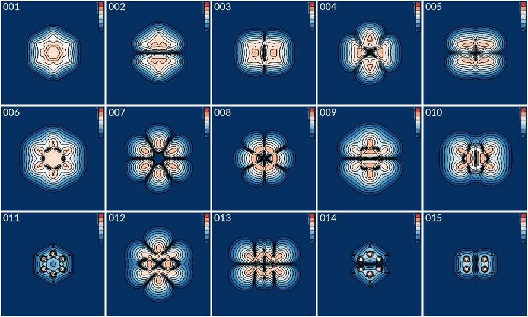

EDP – a program for projecting electron densities
=================================================

.. image:: https://github.com/ifilot/edp/actions/workflows/build.yml/badge.svg
   :target: https://github.com/ifilot/edp/actions/workflows/build.yml
.. image:: https://img.shields.io/badge/License-GPLv3-blue.svg
   :target: https://www.gnu.org/licenses/gpl-3.0

:program:`EDP` is a C++ program designed to project the electron density as
stored in a `CHGCAR <https://www.vasp.at/wiki/index.php/CHGCAR>`_
or `PARCHG <https://www.vasp.at/wiki/index.php/PARCHG>`_ file
(calculated in `VASP <https://www.vasp.at/>`_), onto a plane. With :program:`EDP`,
users can effortlessly define the projection plane based on atomic positions
while also having the option for detailed customization of the plane's position
and direction. Its versatility and ease of use make EDP a handy tool for
researchers in the field of materials science.

   The electron density of the 15 occupied Kohn-Sham states of the benzene
   molecule visualized using :program:`EDP`.

:program:`EDP` has been developed at the Eindhoven University of Technology,
Netherlands. :program:`EDP` and its development are hosted on `github
<https://github.com/ifilot/edp>`_.  Bugs and feature
requests are ideally submitted via the `github issue tracker
<https://github.com/ifilot/edp/issues>`_.

.. toctree::
   :maxdepth: 2
   :caption: Contents:

   installation
   background
   examples
   user_interface
   publications

Indices and tables
------------------

* :ref:`genindex`
* :ref:`search`
